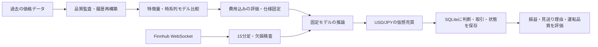

# FXの機械学習・データ品質・仮想売買の研究

**過去の価格から作った売買判断が、新しく届く価格でも再現できるかを検証するPythonプロジェクトです。** USD/JPYを中心に、特徴量生成・モデル比較・費用込みの評価から、通信断や再起動を考慮した仮想売買までを扱います。

[採用担当者向け・3分ガイド](docs/REVIEW_GUIDE.md) · [研究結果](research/README.md) · [コード](#コードを見る)

## このプロジェクトで作ったもの

- **時系列MLの検証基盤**：価格から特徴量を生成し、Random Forest・勾配ブースティング等を時系列順に比較。
- **データ品質と計算の検査**：価格系列の混在調査、履歴の再構築、未来情報の混入検査、特徴量・約定時刻・費用の照合。
- **費用込みのバックテスト**：損益・取引件数・最大下落に加え、費用を悪化させた条件でも評価。
- **仮想売買システム**：Finnhub WebSocketの市場データを15分足へ集計し、判断・取引・状態をSQLiteへ保存。欠損時の見送り、停止、再起動後の重複防止を実装。
- **運転・検証の仕組み**：AWS EC2 / systemdへの配置、unit testとGitHub Actions、APIキー不要の合成データデモ。

## Tech Stack

**Python / pandas / NumPy / scikit-learn / SQLite / WebSocket / AWS EC2 / systemd / GitHub Actions**

## Architecture

過去データの研究と、新しく届く価格による検証を分け、モデルの計算と運転状態の両方を確認します。



## Research Highlights

### 1. 高い過去成績から、データの再調査へ

異常に高い成績をそのまま成果にせず、急な価格変化と直後の反転を調査しました。価格系列の混在を示す異常が見つかり、年別CSVから**2016年〜2026年9月1日の265,905行を再構築**して再評価しています。混在データによる以前の高い数値は、現在の性能根拠から外しています。[調査・再構築・再評価の記録](docs/RESEARCH_FX3.md)

### 2. 時系列の境界と、特徴量の再現性を検査

学習・検証・評価の順序を守り、予測対象期間が次の評価区間へまたがないよう境界を除外する処理を実装しました。テストでは、未来の価格を書き換えても過去の特徴量が変わらないことを確認します。別途、直近250本だけで計算すると符号特徴が変わる問題を調べ、正規の全履歴を使った418時点の照合で最大差0を記録しています。[分割処理](src/fx_research/splits.py) · [特徴量テスト](tests/test_frozen_features.py)

### 3. 予測から仮想売買まで、同じ意味の計算へ

シグナル時刻・入口と出口の価格・取引量に応じた費用を照合し、過去300取引の再現一致を保存しています。新しい価格による検証では、判断後に受信した観測で仮想約定し、再起動後の二重処理や保有中の長い観測欠損をテストします。過去の照合とforward testは別の検証です。[照合の記録](docs/RESEARCH_FX3.md) · [状態遷移テスト](paper_trading/test_comparison.py)

## 主な結果

以下は保存済みの研究記録です。異なる期間・データ・費用条件の数値を、同じ条件の成績として比較していません。

| 検証 | 記録された結果 | 解釈 |
|---|---|---|
| 再構築後の特徴量比較（2020〜2025年） | 30・41・54特徴量を比較し、41特徴量の仕様を固定 | 費用悪化や年別の感度も確認。全指標で改善したわけではない |
| 過去2026年の照合 | 300取引の時刻・価格・損益計算が一致 | 保存出力による計算一致。新しい市場で300回取引した実績ではない |
| 9月16日の予測監査（約14時間） | 55判断中27正解、49.1% | 予測期間が重なる少数標本。取引勝率とは異なる |
| 4通貨・32評価／72候補・2期間の探索 | 新通貨の採用なし／採用基準通過0候補 | 最低取引件数と通常・悪化費用の条件を含めて判定 |
| 9月16〜17日の24時間仮想売買 | 1取引、仮想100万円に対し−588.96円、正常終了 | 処理完了の記録であり、収益性を判断できる件数ではない |

期間別の損益・費用条件・元出力は [研究結果と報告一覧](research/README.md) から確認できます。

## Forward Test：実装・運転の到達点

**リポジトリに保存された運転記録は2026年9月17日時点です。リアルタイムの稼働表示ではありません。**

同日16:59（日本時間）にEC2上のサービスを開始し、17:12時点で4通貨の受信と履歴準備を確認しています。保存された比較構成では、他の3通貨を研究候補の入力に使い、売買対象をUSD/JPYに限定しています。各通貨150本の品質条件付き履歴がそろい、両モデルが準備できてから30暦日を測定する設計です。

Linux上でモデル読み込み・30テスト・接続を確認済みですが、**30日間のforward test完了結果は未掲載**です。運転条件と確認時点は [クラウド運転記録](docs/CLOUD_PAPER_20260917.md)、今後の評価項目は [最終報告の様式](docs/FORWARD_REPORT_TEMPLATE.md) にまとめています。

## コードを見る

| 入口 | 読める内容 |
|---|---|
| [src/fx_research/](src/fx_research/) | 特徴量・モデル・時系列分割・バックテスト。固定済み41特徴量は `frozen/`、以前の比較実装とは区別 |
| [paper_trading/](paper_trading/README.md) | 収集、品質判定、推論、SQLiteでの状態管理、停止・復旧、レポートの参照コード |
| [tests/](tests/) | 未来情報混入、時間境界、費用、原本との計算一致。運転の検査は `paper_trading/test_*.py` |

## Reproduction / Demo

リポジトリのルートから実行します。研究コードの検査はPython 3.11以上です。

```bash
python -m pip install -e .
python -m unittest discover -s tests -v
```

仮想売買はPython 3.13の別環境を使います。[環境の作成手順](paper_trading/README.md) に従い、次を実行できます。

```bash
python -m pip install -r paper_trading/requirements.txt
python -m unittest discover -s paper_trading -p 'test_*.py' -v
python paper_trading/demo.py
```

デモは人工価格とダミー判断で約定・再起動・重複防止・決済を示します。APIキーや学習済みモデルは不要で、損益は説明用です。仮想売買の30テスト中、非配布モデルに依存する1件はskipされます。これらのテストは研究全体の再学習や過去300取引の再実行ではありません。

## Limitations

- **収益性は未実証**です。モデルの確信度、方向予測の正答率、費用控除後の取引勝率を区別しています。
- 2026年など既に探索した期間を未使用の最終評価とは扱いません。候補数、少ない取引件数、時系列の依存性を踏まえた後続評価が必要です。
- 価格再構築後も、大きな値動きや利益集中の注意は残っています。全異常を除去したとは結論付けていません。
- 生データ・学習済みモデル・稼働DB・認証情報は非同梱です。完全再現には追加の入力が必要で、公開範囲の参照コードだけでは運転パッケージ検査も通りません。
- 仮想約定は観測価格と想定費用によるもので、実際のbid/askによる約定実績ではありません。実注文APIはありません。記録時点で外部通知・自動外部バックアップは未設定です。

開発・調査・テスト・文書整理にはAI支援を利用しています。[著者とAI支援](docs/REVIEW_GUIDE.md#著者とai支援) に説明を残し、すべてを独力で実装したとは主張しません。

## 詳細資料・読む順番

1. **3分で概要**：[採用担当者向けガイド](docs/REVIEW_GUIDE.md)
2. **研究結果**：[実験の順序と結果](research/README.md)
3. **コード**：[仮想売買の構成](paper_trading/README.md)・[研究コードの案内](docs/CODE_GUIDE.md)
4. **研究履歴**：[データ再構築と照合](docs/RESEARCH_FX3.md)・[Notebook一覧](notebooks/README.md)

再現範囲の詳細は [閲覧・再現手順](docs/REPRODUCIBILITY.md)、今後の課題は [改善計画](docs/ROADMAP.md) を参照してください。
