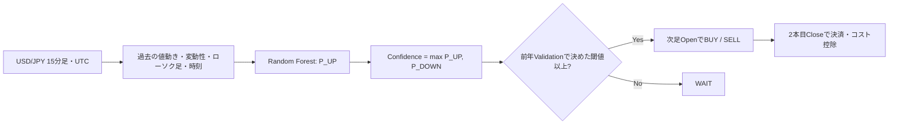
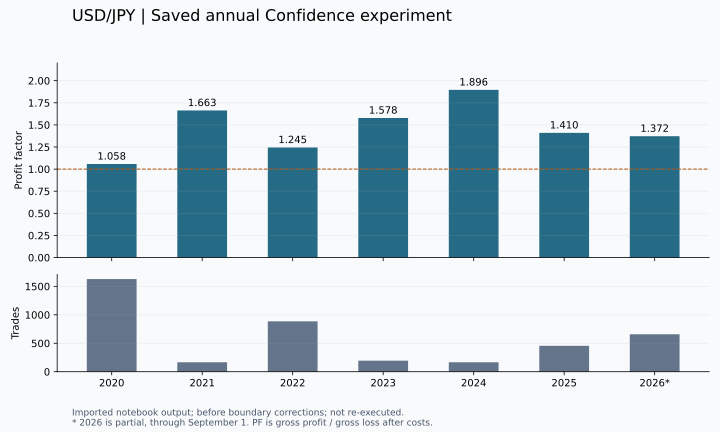

# USD/JPY Machine Learning Research

**予測をすべて取引するのではなく、選別した取引にコスト控除後の優位性があるかを検証する時系列機械学習プロジェクト。**

Python · pandas · scikit-learn · Random Forest · Nested Walk-Forward · Backtesting

[研究の経緯](docs/RESEARCH.md) · [検証方法](docs/METHODOLOGY.md) · [コード監査](docs/CONFIDENCE_AUDIT.md) · [実行方法](docs/REPRODUCIBILITY.md)

## まず知ってほしいこと

- **目的**：USD/JPYの短期売買について、予測精度だけでなく取引コスト・取引数・期間ごとの安定性を評価する。
- **現在の手法**：15分足から30分先の方向をRandom Forestで予測し、Confidenceが基準以上の候補だけを採用する。
- **検証設計**：前年までのValidationでConfidenceの閾値を決め、翌年のTestへ固定する。年ごとに過去データで再学習する。
- **現在地**：元Notebookには2020〜2026年の集計で4,153取引・PF 1.238の保存結果がある。ただし年境界と欠測の処理に修正が必要で、**修正後の実価格データによる再評価は未実施**。

このリポジトリでは、良かった数字だけでなく、採用しなかった仮説と計算上の問題も記録しています。

## 現在の処理



Confidenceはモデルの予測スコアであり、校正された実勝率ではありません。現在の年別実験にはMOVEモデル・Qualityモデル・TP/SL・可変取引量を含めません。

## 保存されていた年別結果

出典：`FX (1).ipynb` **セルindex 35**の保存出力。以下は整理時に再実行した数値ではありません。修正前の結果として掲載しています。

| Test年 | 前年に選んだ閾値 | 取引数 | 純利益の出た割合 | PF |
|---|---:|---:|---:|---:|
| 2020 | 55% | 1,628 | 51.84% | 1.058 |
| 2021 | 58% | 166 | 63.25% | 1.663 |
| 2022 | 56% | 885 | 56.27% | 1.245 |
| 2023 | 58% | 194 | 59.28% | 1.578 |
| 2024 | 58% | 166 | 68.07% | 1.896 |
| 2025 | 56% | 456 | 58.99% | 1.410 |
| 2026（途中） | 55% | 658 | 56.08% | 1.372 |

**保存集計**：平均純損益 **+0.005452% / 取引**、統合PF **1.237896**、決済ベース最大DD **−3.045907%**。7評価区間で平均純損益・PFともにプラス側ですが、2026年は9月1日までの部分期間です。原本の「Accuracy」はここでは純利益の出た割合を表します。



[年別表のCSV](results/published/nested_annual_saved.csv) · [元の保存出力](results/imported_20260907/cell_35.txt)

PFは利益合計÷損失合計です。年別PFの平均1.460と、全取引を統合したPF 1.238は異なる集計です。資産の成長率を将来の予想収益には使いません。

## 何を試し、なぜ現在の設計になったか

| 見つかった課題 | 試した方法 | 保存結果から得た判断 |
|---|---|---|
| 方向予測だけでは弱い | MOVEとDirectionを分け、Qualityで選別 | Quality再検証でも平均純損益の改善なし |
| BUYに偏り、SELLの好成績は少数 | 売買方向の診断、別々の閾値 | SELLを48件まで増やすと平均純損益はマイナス |
| 高Confidenceほど取引量を増やせるか | Confidence sizingと確率校正 | 未校正はPF 0.962、校正版は1.163。小標本の探索に留まる |
| 30分という設定は妥当か | 5〜120分のhorizon比較 | この比較では全候補で平均純損益がマイナス |
| 短期データだけでは判断しにくい | Dukascopyの長期15分足へ移行 | 約26.6万行で検証対象を拡大 |
| モデルが覚えただけではないか | RF・Logistic Regression・Shuffle比較 | RF平均Test AUC約0.530、Shuffle約0.501。全件売買ではコストに負ける |
| 高Confidenceの成績は後付けではないか | 年別Nested検証で閾値選択も過去へ限定 | 保存結果は前向き。ただし境界修正後の再評価が必要 |

各行は異なる条件の実験です。単純な性能ランキングにはできません。[研究報告と出典一覧](docs/RESEARCH.md)

## 実装として確認できること

- **時系列処理**：過去だけで特徴量を作り、正解ラベルが判明する時刻を管理する。
- **検証設計**：モデル学習・閾値選択・Test評価を分離する。
- **バックテスト**：次足約定、コスト、非重複、初期資産を含むDDを明示する。
- **再現性**：入力データとソースのSHA-256、設定、依存関係、スキップ理由を保存する。
- **テスト**：未来価格を変えても過去特徴量が変わらないこと、年境界のラベル除外、手計算できる損益を検証する。

## 実行する

Python 3.11以上。リポジトリ直下で実行します。生データは同梱していません。

```bash
python -m pip install -e .
python -m unittest discover -s tests -v
python -m fx_research.confidence --csv data/raw/usdjpy_15m_2016_2026.csv --out results/runs/confidence-001
```

CSVはUTC offset付きの足開始時刻と、小文字の `open, high, low, close` 列が必要です。[データ仕様と手順](docs/REPRODUCIBILITY.md)

Notebookで読む場合は [09_confidence_nested.ipynb](notebooks/09_confidence_nested.ipynb) が現在の入口です。GitHubから結果表まで読むだけなら、Python環境の準備は不要です。

## リポジトリの案内

| 場所 | 内容 |
|---|---|
| `src/fx_research/confidence.py` | 現行15分足・年別検証。年境界と時刻処理を修正 |
| `src/fx_research/confidence_features.py` | 元の最新実験から抽出した特徴量 |
| `docs/` | 研究の経緯、方法、監査、再現手順、コード解説 |
| `notebooks/archive/` | 16段階の履歴。元コードの出典とハッシュを保持 |
| `results/imported_20260907/` | 新Notebookの保存出力。再実行結果とは区別 |
| `results/published/`・`results/figures/` | 読みやすく再構成した保存結果表と図 |
| `tests/` | 人工データによる計算・境界・統合テスト |

以前の5分足Quality系は [旧ベースライン](docs/QUALITY_BASELINE.md) に説明を残し、`fx_research.pipeline` から引き続き実行できます。

## 次に確認すること

1. 元の長期CSVを固定し、年境界・欠測を修正したコードで再評価する。
2. BUY／SELL・年・時間帯に分解し、損益が一部の条件へ集中していないか確認する。
3. 時系列依存を考慮した信頼区間、コスト感度、新しい未使用期間を検証する。

現在は研究コードです。元データはBID系列で、一定コストを引く近似評価です。実際のbid/ask約定、スリッページ、運用・発注機能はまだ検証していません。
