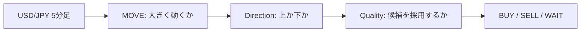

# USD/JPY Machine Learning Research

**短期為替取引の候補選別を、時系列検証と取引コストを含めて評価するPython研究プロジェクト。**

`Python` · `Random Forest` · `Time Series` · `Walk-Forward Validation` · `Backtesting`

> **研究段階：有効性は未確認。** 保存済みのTrade Quality実験では、取引数と最大ドローダウンは減少した一方、平均純損益とProfit Factorは改善しませんでした。本リポジトリは、その結果と検証上の課題を含めて記録しています。

## この研究で取り組むこと

ドル円の5分足から、30分間の売買候補を選びます。中心の問いは「上がるか下がるか」だけでなく、**未見の期間でも、コスト控除後の期待値がプラスになる取引を十分に選べるか**です。



- **MOVE**：次足始値から6本目終値までの絶対リターンが0.05%を超えるか。
- **Direction**：MOVEを満たす学習サンプルから、上昇・下落を予測。
- **Quality**：過去のモデルによる将来区間への予測を使い、方向付きリターンからコストを引いてプラスになるかを学習。

## 主な取り組み

| 課題 | 実装・検証 |
|---|---|
| 相場によって予測性能が変わる | 過去から未来へ進むWalk-Forward、20日半減期の学習重み |
| 高い勝率でも損益がマイナスになる | 平均純損益、PF、ドローダウン、MFE/MAEによる診断 |
| 学習済みデータへの予測でQualityが過大評価される | 内部のforward / out-of-fold予測からQualityを学習 |
| Notebookの状態に依存する | ローカルCSVを入力にするパッケージ、設定・データハッシュの保存 |
| バックテストの計算が結論を左右する | 売買タイミング、売り損益、コスト、境界、初期損失のテスト |

## 保存されていた最新結果

出典：提供された `FX.ipynb` のセルindex 15。**再実行値ではありません。修正後のコードの成績でもありません。** 全5foldのうちfold 1はValidationで設定を選べず、以下はfold 2〜5の集計です。

| 指標 | BASE | QUALITY FILTER |
|---|---:|---:|
| 取引数 | 404 | 275 |
| 勝率 | 50.247525% | 51.636364% |
| 平均純損益 / 取引 | −0.003214% | −0.003666% |
| Profit Factor | 0.897677 | 0.884695 |
| 最大ドローダウン（旧計算） | −1.520048% | −1.155146% |

**解釈：現在のQuality仮説は、集計期待値の改善を支持していません。** foldごとの改善も一様ではありません。下記の監査で旧計算の問題も判明しており、元の期間・価格データを確保した再評価が必要です。

→ [実験の流れと考察](docs/RESEARCH.md) · [コード監査と修正点](docs/AUDIT.md) · [出典ログ](results/legacy/cell_15.txt)

## 実行方法

Python 3.11以上を対象とします。以下はリポジトリ直下で実行します。依存関係の範囲は `pyproject.toml` に定義しています。元Notebookの環境を復元したロックファイルではありません。

```bash
python -m venv .venv
```

Windows PowerShell：`.venv\Scripts\Activate.ps1`
macOS / Linux：`source .venv/bin/activate`

```bash
python -m pip install -e .
python -m unittest discover -s tests -v
python -m fx_research.pipeline --csv data/raw/usdjpy_5m.csv --out results/runs/quality-001
```

実価格データは同梱していません。[データ形式](data/README.md)に沿った固定CSVが必要です。出力先には未作成のディレクトリを指定してください。全foldで複数回RandomForestを学習するため、実行時間はデータ量とCPUに依存します。

Notebookから使う場合：

```bash
python -m pip install -e ".[notebook]"
jupyter lab notebooks/08_trade_quality.ipynb
```

## 出力と再現性

| 出力 | 内容 |
|---|---|
| `run.json` | 入力SHA-256、データ期間、設定、Python・依存関係のバージョン、ソースハッシュ、完了状態 |
| `folds.csv` | 全foldの実行／スキップ理由、Validationで選んだ設定、Test成績 |
| `trades.csv` | 売買方向、時刻、価格、決済理由、コスト、純損益 |
| `summary.csv` | BASE / QUALITYの全体・BUY・SELL別成績 |
| `test_scores.csv` | 評価済みfoldの各モデルの予測スコア |
| `quality_importance.csv` | 評価済みfoldごとのRandomForest不純度ベース重要度 |

損益と勝率はCSVでは小数単位です（`0.001 = 0.1%`）。重要度は因果関係や安定した説明力を意味しません。実行結果と生データはGitの追跡対象から除外し、レビューした結果だけを別途掲載します。

## 構成

```text
├── README.md                     # プロジェクト概要・実行方法
├── PROJECT_CONTEXT.md            # 更新済みの引き継ぎ
├── docs/                         # 研究報告・監査・コード解説
├── src/fx_research/               # 再利用可能な検証コード
├── notebooks/08_trade_quality.ipynb
├── notebooks/archive/            # 7段階の研究履歴（元コード保持）
├── results/legacy/               # 保存出力・出典ハッシュ
├── data/README.md                # 入力データの契約
└── tests/                        # 人工データによる回帰テスト
```

## 検証の前提と限界

- シグナルは足の確定後、エントリーは次足Open、時間決済は6本目Close。早期決済後も6本分のシグナル抑制を維持します。
- TP・SLが同一足で成立する場合はSLを先行。ストップを飛び越える始値は、その始値で損失を計上します。
- コストは1取引につき小数 `0.0000133`（0.00133%）の暫定的な往復コスト。実ブローカーの約定は未検証です。
- Train→Validation→Testを分離し、6行の間隔を設けます。評価区間の終了後の価格を使う取引は除外します。
- 過去のTestを何度も研究に使っています。統計的な確認には、新しい将来holdoutも必要です。
- 品質ラベルは時間決済損益、実際の評価はTP/SL込みであり、目的のずれが残っています。
- 実データの再実行、コスト耐性、運用システム、発注機能は未完了です。

## 次の検証

1. 固定データと実行環境を保存し、修正後のBASE / QUALITYを比較する。
2. Qualityスコア帯と実損益の関係、期間・売買方向ごとの安定性を診断する。
3. 独立した将来期間と厳しいコスト条件で仮説を再評価する。

[Pythonコードの読み方](docs/CODE_GUIDE.md) · [変更履歴](CHANGELOG.md)
