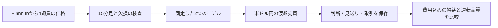

# FXの機械学習・データ品質・仮想売買の研究

**過去の価格から作った売買判断が、新しく届く価格でも再現できるかを検証するPythonプロジェクトです。**

予測モデルを作るだけでなく、データの欠損、取引費用、通信断、再起動によって結果がどう変わるかを確認しています。目的は、利益を約束することではなく、判断の根拠と検証の限界を追える仕組みを作ることです。

[採用担当者向け・3分ガイド](docs/REVIEW_GUIDE.md) · [研究の全体像と結果](research/README.md) · [クラウド運転の記録](docs/CLOUD_PAPER_20260917.md) · [コードの読み方](paper_trading/README.md) · [用語集](docs/GLOSSARY.md)

## 現在の到達点

2026年9月17日、日本時間16:59にAWS EC2で新しい収集・仮想売買サービスを開始しました。**17:12時点の確認では4通貨の価格を受信し、比較開始に必要な履歴を準備中です。30日間の成績はまだありません。** この記述は確認時点の記録で、リアルタイムの稼働表示ではありません。

- 価格取得はFinnhubのWebSocketのみ。実資金の注文は出しません。
- 米ドル／円の既存モデルと研究候補を、同じ期間・同じ取引量と費用条件で比較します。
- 他の3通貨は研究候補の入力に使います。この運転で売買するのは米ドル／円だけです。
- 品質条件を満たす15分足を各通貨150本集め、両モデルが準備できてから30暦日を測定します。

## 何を確認してきたか

| 検証 | 確認したこと | 結果の読み方 |
|---|---|---|
| データの再構築 | 混在が疑われる価格を調査し、265,905行を再構築 | 以前の高い成績を現状の成果として扱わない |
| 過去の計算の再現 | 300取引の時刻・価格・費用が一致 | 将来の利益を示す実績ではない |
| 新しい価格での予測評価 | 採点可能55判断中27正解、49.1% | 少数かつ重複する予測期間。取引勝率とは異なる |
| 複数通貨の比較 | 4通貨・32評価を実施 | 新しい通貨の採用には至らなかった |
| 条件を広げた探索 | 72候補を2期間で評価 | 最低取引件数と費用悪化条件を含む採用基準の通過は0候補 |
| 24時間の仮想売買 | 1取引、仮想100万円から−588.96円 | 正常終了の記録。収益性を判断できる件数ではない |
| クラウドへの移行 | Linux上で30テストと4通貨接続を確認 | 外部通知・自動外部バックアップは未設定 |

採用基準を満たさなかった120分保有の候補も、**研究対象**として既存モデルと並べて観察します。良かった一部の期間だけで「利益が出るモデル」とは判断していません。

## 仕組み



モデルの「58%」という出力は、そのまま実際の勝率58%を意味しません。評価では取引数、費用控除後の損益、最大下落、見送った理由、欠損や停止も確認します。

## 読む順番

1. [研究の案内](research/README.md)：目的、実験の順序、失敗を含む結果。
2. [クラウド運転の記録](docs/CLOUD_PAPER_20260917.md)：開始条件、比較方法、残っている作業。
3. [仮想売買コード](paper_trading/README.md)：ファイルの役割とテスト方法。
4. [以前の研究報告](docs/RESEARCH_FX3.md)・[Notebook一覧](notebooks/README.md)：データ修正とモデル固定までの経緯。

使用技術：Python、pandas、scikit-learn、SQLite、WebSocket、systemd、AWS EC2、GitHub Actions。

## 手元で確認する

APIキー・学習済みモデルなしで挙動を確認する [合成データのデモ](docs/REVIEW_GUIDE.md#10分で動きを確認する) を用意しています。人工価格によるソフトウェアの説明で、予測性能や収益性の実績ではありません。

[改善計画](docs/ROADMAP.md) · [30日間の最終報告様式](docs/FORWARD_REPORT_TEMPLATE.md)


既存の研究コード：

```bash
python -m pip install -e .
python -m unittest discover -s tests -v
```

新しい仮想売買の参照コードは、[専用の手順](paper_trading/README.md)で別環境から検査できます。学習済みモデル、配信元の生データ、APIキー、稼働中の口座DBは同梱していません。リポジトリだけで実運転や研究全体の再学習を完全再現できる配布物ではありません。

[既存コードの検証記録](docs/VERIFICATION.md) · [今回追加したコードの検証範囲](docs/VERIFICATION_20260917.md)
