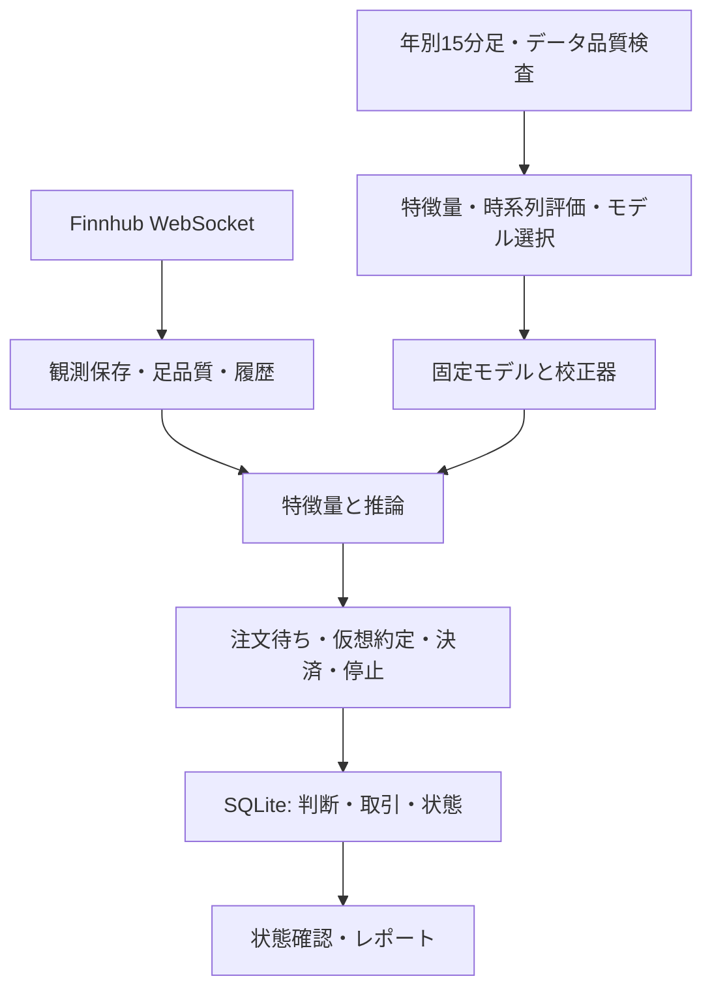

# 構成とコードの入口

この文書は構成の正本です。採用結果は [RESULTS](RESULTS.md)、実行方法は [REPRODUCIBILITY](REPRODUCIBILITY.md) に分けています。

| 対象 | 実装・資料 | 役割 |
|---|---|---|
| 固定候補の特徴量 | [src/fx_research/frozen/](../src/fx_research/frozen/) | 原本との計算照合。学習済みモデルは非公開 |
| 以前の比較実験 | [src/fx_research/](../src/fx_research/)・[研究履歴](archive/README.md) | HGB/RF/Quality等。すべてが現在の固定モデルではない |
| データ収集 | [collector.py](../paper_trading/collector.py)、[quality.py](../paper_trading/quality.py)、[history.py](../paper_trading/history.py) | 受信観測、欠損、判断可能な履歴を管理 |
| 推論 | [frozen_inference.py](../paper_trading/frozen_inference.py)、[predictors.py](../paper_trading/predictors.py) | 保存済みモデルへ特徴量を渡す |
| 状態機械 | [engine.py](../paper_trading/engine.py) | 売買判断、仮想約定、停止、SQLite保存 |
| 運転 | [runner.py](../paper_trading/runner.py)、[deploy/](../paper_trading/deploy/) | 収集ループとsystemd設定例 |

## engineを読む順番

`atomic_step()` はSQLiteのトランザクションとメモリ状態を一緒に扱います。例外時は両方を元に戻します。`_step()` は次の順序だけを管理します。

1. 終了状態と時計の逆行を確認。
2. `_process_ticks()`：観測ID・時刻を検査。同じ観測では決済、注文待ちの約定、時価評価の順。
3. `_check_deadlines()`：観測途絶、注文期限、比較期間終了、準備期限を確認。
4. `_process_bar()`：足の品質と推論を確認し、`_record_prediction()` で判断・注文待ちを記録。

`state / decisions / trades / equity / events` がSQLiteの保存先です。判断済みの足と消費済み観測IDを保存し、再起動で同じ取引を重複作成しないようにしています。欠損や停止後の再開を、成功した取引として補完しません。

## 公開コードとクラウドを区別する

| | 公開参照実装 | 9月28日に確認した配備物 |
|---|---|---|
| 入力・モデル | 4通貨入力、base/candidateの2モデル | ドル円単独・固定baseモデル |
| 口座 | base_fixed / candidate_fixed / base_legacy | base_fixed / base_legacy |
| 用途 | コードレビュー、合成デモ、オフライン検査 | 30日forward paper test |

公開コードのリファクタリングを稼働中のEC2へ反映していません。`bundle_hashes.json` は元パッケージの証拠として維持し、この変更後の配備manifestには使いません。systemd設定例があることと、バックアップや外部通知が実際に有効であることも別です。
