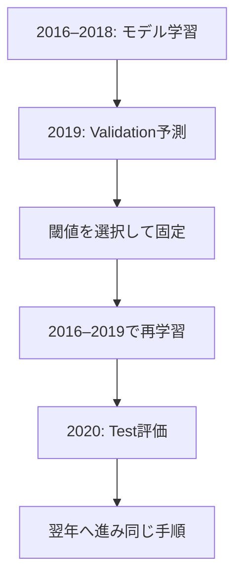

# 現行Confidence戦略の検証方法

## 入力と特徴量

Dukascopy USD/JPY BID 15分足をUTCの足開始時刻で扱います。元Notebookは265,905行、2016-01-03 22:00 UTCから2026-09-01 00:00 UTCまでを表示していました。
リターン（1/2/4/8/16本）、変動性、移動平均との距離と傾き、ローソク足、RSI、ATR、高値・安値との距離、時刻・曜日の30特徴を使います。
すべてシグナル足までの値です。特徴量の式はセル35から抽出しました。rollingは足数ベースで、週末前の履歴を参照し得ます。

## 何を予測するか

足tの終値が確定した後に判断し、`Open(t+1)`で入り、`Close(t+2)`で決済します。
価格変化率が正なら上昇ラベル、そうでなければ非上昇ラベルです。Random Forestは250本、深さ8、葉の最低30件、balanced class weights、seed 42。
MOVEやQuality、時間減衰重みはこの最新実験にありません。

| 条件 | 内容 |
|---|---|
| Confidence | max(P(up), P(down)) |
| BUY / SELL | P(up) >= 0.5ならBUY、未満ならSELL |
| 閾値候補 | 0.50 / 0.52 / 0.54 / 0.55 / 0.56 / 0.58 / 0.60 / 0.62 / 0.65 |
| Validation最低取引数 | 100 |
| 選択スコア | 平均純損益 × sqrt(取引数) |
| コスト | 1取引につき往復0.00004（0.004%）を控除 |
| 売り損益 | −(exit/entry − 1)、買いと同じエントリー元本基準 |
| TP/SL・可変取引量 | なし |
| 非重複 | 新しいentry_time >= 前のexit_time |

最良Validationスコアがマイナスでも、最低取引数を満たす候補があれば選びます。これは元実験の仕様です。
「Validationがプラスの場合だけ取引する」という別戦略を暗黙に追加していません。

## 年別の学習と評価

最新の修正では、ラベルが判明する時刻 `label_end = index(t+2)+15分` を保持します。
TrainのラベルがValidation開始までに、最終TrainのラベルがTest開始までに判明していることを条件にします。
Validation/Testの取引もそれぞれの年内で決済する必要があります。欠測や週末をまたぎ、t→t+1→t+2が連続しない候補は除外します。

## 指標の意味

- **方向的中率**：採用取引の予測クラスが実際の上昇／非上昇ラベルと一致する割合。値動き0は非上昇クラス。
- **純利益の出た割合**：コスト控除後の純損益>0の割合。元のセル35で「Accuracy」と表示していた値。
- **PF**：純利益合計÷純損失の絶対値合計。損失0はinf、全損益0は未定義。
- **平均純損益**：取引ごとの平均。年別平均の単純平均とは異なる。
- **DD**：初期資産1を含む、決済時点の資産曲線から計算。含み損最大値ではない。

時系列で分けても、研究中に何度も同じTestを見て仮説を変えることで過適合は起こり得ます。
年境界を直すだけで統計的独立性が保証されるわけではありません。新しい未使用期間と時系列依存を考慮した検証が必要です。
