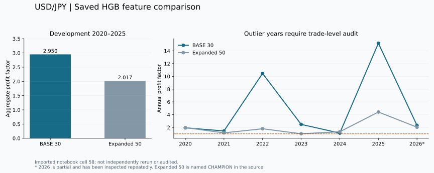

# 2026-09-09 研究更新

## 今回の問いと結論

「方向予測のモデルを変え、確率の校正・時間帯・取引量・特徴量を組み合わせると、選別した取引の質は改善するか」を検証しました。
最新のセル58では、HGBのBASE 30特徴量と、Volatility / Regimeを加えた50特徴量を比較しています。
保存結果では、50特徴量は開発期間の平均純損益・PF・Return/DDでBASEを上回りませんでした。
**BASEを次の監査の比較基準に残し、特徴量追加の採用は保留**とするのが、この結果から説明できる判断です。

数値は添付Notebookの保存出力から抽出しました。今回のGitHub整理で実価格学習を再実行した数値ではありません。
元セル内の「ROBUST」「CLEAR OOS VALUE」「CHAMPION」は自動判定名であり、独立した監査の合格証明ではありません。

## 実験の順序

| 段階 | 試したこと | 保存結果と次の判断 |
|---|---|---|
| セル36 | 年境界・欠測修正、相場状態別診断 | Corrected overall PF 1.203515。前回のセル35のPF 1.237896とは別の実行 |
| 37–38 | 時間帯選別、同じ予測で時間帯の追加価値を比較 | Sessionの改善を報告。ただしコスト・期間・比較条件を分けて読む |
| 39–41 | 5分足によるTP/SL、保有時間 | 39はCSV不足で失敗。40のTP/SL PF 2.261は固定Exit 2.281を上回らず。41のNested評価は1年のみで、30分固定を維持 |
| 42–43 | RAW / Platt / Isotonicの校正 | 43はBrier 0.249385→0.249255、ECE 0.011196→0.007300。改善幅と高Confidenceの少数標本を区別 |
| 44–45 | Confidenceに応じた取引量と配分効果 | 44では改善年2/7で採用保留。45は平均Exposureを揃えて配分効果を診断。可変Sizingが有効だった年は2025・2026に限定 |
| 46–49 | Risk Engine、過去年からのリスク設定選択 | v1は_trade_id参照エラー。v2は6年ともNO_RISKを選び、追加の改善なし |
| 50 | RF / ExtraTrees / HGB / Logistic | 保存された2026比較ではHGB PF 1.805、RF 1.426。HGBのAUCはRFより低く、予測精度と損益は別指標 |
| 51–53 | HGBの全処理への統合 | 51は時間足グリッド異常で停止。52は中央値で15分足と判定して混在を見逃す。53の出力は修復前の別データ状態 |
| 54 | Trend / Momentum追加 | PF・平均純損益・Return/DDで改善せず、追加を保留 |
| 55 | Volatility / Regime追加 | 探索用の比較では追加価値ありと自動判定。完全な処理への再統合で確認する段階へ |
| 56–57 | 再統合前のデータ検査と再集約 | 56はグリッド異常を検知。57で275,704行を266,510行へ15分集約。ただし元の足の完全性は別途監査が必要 |
| 58 | HGB BASE / 50特徴量の再統合 | 50特徴量は開発期間でBASEを超えず。2022・2025の極端な成績とデータの来歴を次に監査 |

各実験では予測・期間・データ状態・実行規則が異なります。表のPFを並べて改善曲線として扱いません。

## 最新の比較：セル58

| 指標 | BASE・30特徴量 | 拡張候補・50特徴量 |
|---|---:|---:|
| 開発評価期間 | 2020–2025 | 2020–2025 |
| 取引数 | 1,565 | 1,322 |
| 平均純損益 / 取引 | 0.0357% | 0.0216% |
| 統合PF | 2.949785 | 2.017441 |
| 複利成長率（期間全体） | 72.0391% | 32.1141% |
| 決済ベース最大DD | −2.1667% | −1.9503% |
| 2倍コストのPF | 2.573339 | 1.764193 |
| 2026途中の取引数 | 171 | 201 |
| 2026途中のPF | 2.322168 | 2.033613 |

平均純損益・成長率・DDは保存表の小数を百分率へ換算した値です。Sizing適用後の成績で、年利ではありません。
2026途中では、拡張候補はAUC・DD・Return/DD等で良い値も示しています。一律に無価値とは断定しません。

[年別CSV](../results/published/hgb_annual_saved.csv) · [開発期間CSV](../results/published/hgb_development_saved.csv) · [コストCSV](../results/published/hgb_cost_saved.csv) · [元出力](../results/imported_20260909/cell_58.txt)

## 次に検証すること

1. セル57の集約前後を照合し、足の長さ・価格の出所・重複・欠落を固定CSV単位で監査する。
2. BASEの2022（PF 10.463、81取引）・2025（PF 15.197、132取引）の上位利益取引、価格ジャンプ、損益集中、Sizingを確認する。
3. 監査済みの同一データ・同一処理でBASE / +VOL / +REGIME / +VOL+REGIMEを比較する。
4. 仕様を固定し、まだ分析に使っていない期間で検証する。2026は繰り返し参照済みのため、独立した最終Holdoutとは呼ばない。
5. その後、足確定・予測ログ・二重注文防止・復旧を備えたペーパートレード環境を構築する。現時点で発注機能はない。

## 原本への対応

セル番号は0始まりのindexです。セル0–35のコードは前回と同一で、以前の履歴を参照します。今回追加分は以下です。

| 履歴番号 | Notebook | 元セルindex |
|---|---|---|
| 17 | [境界修正と市場状態別の診断](../notebooks/archive/17_corrected_regime.ipynb) | 36 |
| 18 | [時間帯選別とコスト感度](../notebooks/archive/18_session_selection.ipynb) | 37, 38 |
| 19 | [TP/SL・最大保有時間と失敗したデータ取得](../notebooks/archive/19_exit_diagnostics.ipynb) | 39, 40, 41 |
| 20 | [RAW・Platt・Isotonicの確率校正](../notebooks/archive/20_probability_calibration.ipynb) | 42, 43 |
| 21 | [取引量と平均エクスポージャーを揃えた比較](../notebooks/archive/21_position_allocation.ipynb) | 44, 45 |
| 22 | [Risk Engine v1のエラーとv2の追加価値検証](../notebooks/archive/22_risk_engine.ipynb) | 46, 47, 48, 49 |
| 23 | [RF・ExtraTrees・HGB・Logisticのモデル比較](../notebooks/archive/23_model_tournament.ipynb) | 50 |
| 24 | [HGB統合と時間足の検査・診断](../notebooks/archive/24_hgb_pipeline.ipynb) | 51, 52, 53 |
| 25 | [Trend / Momentum特徴量の比較](../notebooks/archive/25_trend_features.ipynb) | 54 |
| 26 | [Volatility / Regime特徴量の比較](../notebooks/archive/26_volatility_regime_features.ipynb) | 55 |
| 27 | [時間足再集約とBASE / 50特徴量の再統合比較](../notebooks/archive/27_hgb_reintegration.ipynb) | 56, 57, 58 |

[取り込み記録](../results/imported_20260909/provenance.json)には原本・各コード・保存出力のSHA-256を記録しています。
添付HTMLは研究の説明の補助として読みました。チャットのサイドバー、他の会話名、アカウント情報は公開資料へ転記していません。
HTML内の実装依頼・将来の作業・完成率の見積もりは、今回完了した作業や検証済み事実として扱いません。
